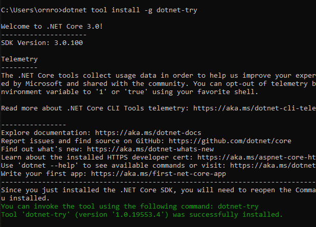
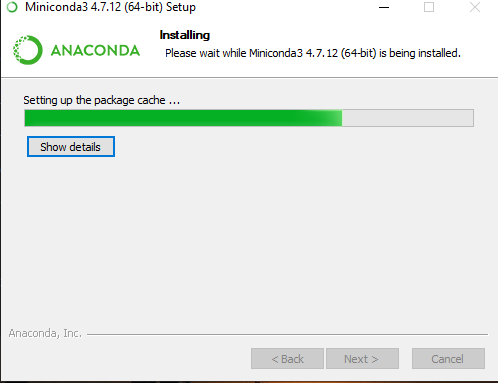
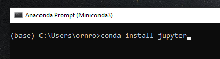
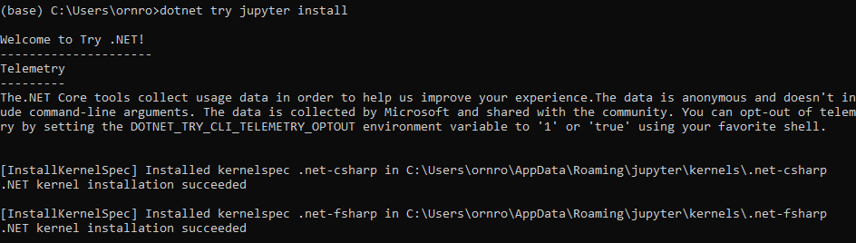
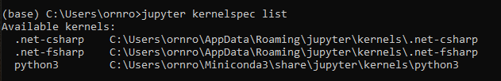
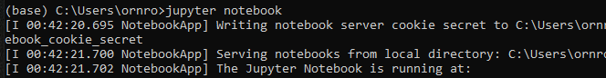
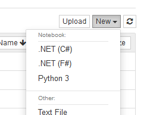

# __Programming in C# __

This repository contains several examples for Exam Ref 70-483 Programming in C#.
All the topics are shown in jupyter notebooks, using Try .NET, where the outputs are immediately available for a better understanding of code samples. 


# [Try .NET](https://github.com/dotnet/try)

Try .NET provides functionalities to generate interactive documentation for .NET Core. 
Basically, developers/users can create runnable coding snippets, allowing readers to execute this code in their browser. 

Additionally, this tool can be integrated with [jupyter](https://jupyter.org/), enhancing the ready-to-run experience for data science, data manipulation and iterative development/learning.

For more information visit:

- [.NET Core with Jupyter Notebooks](https://devblogs.microsoft.com/dotnet/net-core-with-juypter-notebooks-is-here-preview-1/)
- [Using ML.NET in Jupyter notebooks](https://devblogs.microsoft.com/cesardelatorre/using-ml-net-in-jupyter-notebooks/)
- [What is Try .NET](https://www.jimbobbennett.io/trying-out-try-net/)

## Install Try .NET

### Requirements

1. [.NET Core 3.1 SDK](https://dotnet.microsoft.com/download/dotnet-core/3.1)
2. [Jupyter](https://jupyter.org/), it is recommended the installation via [Miniconda](https://docs.conda.io/en/latest/miniconda.html) or Anaconda(https://www.anaconda.com/distribution/).

### Install Try .NET Kernel

1. Open a terminal or command line and execute the following command:

```
dotnet tool install --global dotnet-try

```



2. Install [Miniconda](https://docs.conda.io/en/latest/miniconda.html)



3. Open Anaconda Prompt (windows menu)

4. Install jupyter, executing:

```
conda install jupyter

```




5. Install dotnet-try kernel, run the following command inside Anaconda Prompt:

```
dotnet try jupyter install
```

 

6. Check to see if the .NET kernel is installed:

```
jupyter kernelspec list

```

 

7. Open jupyter notebooks:

```
jupyter notebook

```
 

8. Open or create a C# notebook:

 


# CSharp Notebooks

Clone this repository to your computer and open the notebooks folder inside your jupyter environment. 

## Notebooks

* [Object Oriented Programming](notebooks/OOP/README.md)
* [Input Output Operations](notebooks/InputOutput_operations/README.md)
* [Delegates and Events](notebooks/Delegates/README.md)
* [Multithreading](notebooks/Multithreading/README.md)
* [LINQ (Language Integrated Query)](notebooks/LINQ/README.md)
* [Reflection](notebooks/Reflection/README.md)
* [Cryptography](notebooks/Cryptography/README.md)

   


